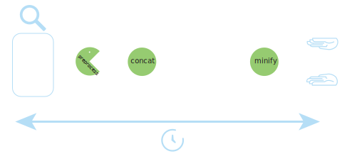

# Web Build?  <!-- .element: style="font-size:4em"-->

----

# Web projects are bigger and bigger

----

# Highest performance 
- first user's impression is APP loading time


----


# LESS 
* data 
* requests  


---

# Concatenation
# Minification 

----

## Concatenation & Minification 
<!-- .element: style="background:transparent;border:0;box-shadow:none;width:100%;"-->


----


## Prerocessors
<!-- .element: style="background:transparent;border:0;box-shadow:none;width:100%;"-->


----

## Info

<!-- .element: style="background:transparent;border:0;box-shadow:none;width:100%;"-->


----

## Test
<!-- .element: style="background:transparent;border:0;box-shadow:none;width:100%;"-->


---


# (MY) Story of build

* No build
* Custom build
* Ant
* Sencha Build

---

# HTML 
# CSS
# JS 


---

# Minification

----

# JavaScript

----

## Minification -JavaScript

- whitespaces
```
\t \r \n
```
- semicolons
- remove dead and unused code

----

### Optimize
- shorten definition using literals
``` 
    var a = new Array(); → var a=[]
```
-  optimize property access
``` 
    a["foo"] → a.foo
```
- evaluate constant expressions
```
var hun = 10*10 → var hun = 100 
```

----

### Optimize 2

- join join consecutive statemets
```
var x;var y; → var x,y
```

- optimize boolean operations
```
var x = false; → var x=!0
```
- optimize conditions

```
if (this.group) {
    this.group.remove();
} → this.group&&this.group.remove(); 
```

----

### Mangle 

```
function on(eventName, fn) {
    this._el.addEventListener(eventName, fn);
};

function on(n,e){this._el.addEventListener(n,e)}
```

----

# CSS

----

## CSS minification

- white space
- merge margin, border, padding
- simplification constructions 

        a {
            color: red;
        }

        a {color: red}

----

## CSS Preprocess
- SASS
- LESS
- Stylus

----

# HTML

     <input type="text" disabled="disabled">

     <input type=text disabled>


---

# NodeJS

* Grunt
* Gulp
* Broccoli

---

# Grunt

----

## Grunt
* json config

---

# Gulp

----

## Gulp

* pipeline


- task
- watch
- src
- dest

---

# Broccoli

----

# Broccoli

* all in memory
