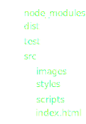

# Web Build?  <!-- .element: style="font-size:4em"-->

----

# Web projects are bigger and bigger

----

# Highest performance 
- first user's impression is APP loading time


----


# LESS 
* data 
* requests  


---

# Concatenation
# Minification 

----

## Concatenation & Minification 
<!-- .element: style="background:transparent;border:0;box-shadow:none;width:100%;"-->


----


## Prerocessors
<!-- .element: style="background:transparent;border:0;box-shadow:none;width:100%;"-->


----

## Info

<!-- .element: style="background:transparent;border:0;box-shadow:none;width:100%;"-->


----

## Test
<!-- .element: style="background:transparent;border:0;box-shadow:none;width:100%;"-->


---


# (MY) Story of build

* No build
* Custom build
* Ant
* Sencha Build

---

# HTML 
# CSS
# JS 


---

# Minification

----

# JavaScript

----

## Minification -JavaScript

- whitespaces
```
\t \r \n
```
- semicolons
- remove dead and unused code

----

### Optimize
- shorten definition using literals
``` 
    var a = new Array(); → var a=[]
```
-  optimize property access
``` 
    a["foo"] → a.foo
```
- evaluate constant expressions
```
var hun = 10*10 → var hun = 100 
```

----

### Optimize 2

- join join consecutive statemets
```
var x;var y; → var x,y
```

- optimize boolean operations
```
var x = false; → var x=!0
```
- optimize conditions

```
if (this.group) {
    this.group.remove();
} → this.group&&this.group.remove(); 
```

----

### Mangle 

```
function on(eventName, fn) {
    this._el.addEventListener(eventName, fn);
};

function on(n,e){this._el.addEventListener(n,e)}
```

----

# CSS

----

## CSS minification

- white space
- merge margin, border, padding
- simplification constructions 

        a {
            color: red;
        }

        a {color: red}

----

# HTML

     <input type="text" disabled="disabled">

     <input type=text disabled>

---

# Processors

----

#JavaScript
- ES6 transpiler
- Dart
- Coffee

----

# CSS 

- SASS
- LESS
- Stylus

----

# HTML
- HAML
- Jade
- Slim
- Markdown,
- template compilers

---

# Other tasks

----

#  External libs
- Bower
- npm

----

## Cache

- filerev
- appcache manifest

----

## Rest
- autodeploy
- documentation generation
- linters


---


# Task runners

----

## Task runners


<!-- .element: style="background:transparent;border:0;box-shadow:none;width:100%;"-->

----

# Typical tasks

## build
## debug server
## build serve

----

# Task runner files

## gruntfile.js
## gulpfile.js
## brocfile.js

----

# Cli

## Gulp cli
    $ npm install -g gulp

## Gulp module
    $ npm install --save-dev gulp

----

## Folder structure

<!-- .element: style="background:transparent;border:0;box-shadow:none;width:30%;"-->


---


<!-- .element: style="background:transparent;border:0;box-shadow:none;width:40%;"-->

----

# File System Directories

----

## Grunt task
<!-- .element: style="background:transparent;border:0;box-shadow:none;width:100%;"-->

----

## Grunt module configuration

```
    usemin: {
      html: ['dist/{,*/}*.html'],
      css: ['dist/styles/{,*/}*.css'],
      options: {
        assetsDirs: ['dist','dist/images']
      }
    },
```

----

## Grunt task 

      grunt.registerTask('build', [
        'useminPrepare',
        'concurrent:dist',
        'autoprefixer',
        'concat',
        'copy:dist',
        'cssmin',
        'uglify',
        'usemin',
        'htmlmin'
      ]);


----

# Grunt - pros and cons

<!-- .element: style="background:transparent;border:0;box-shadow:none;float:left;"-->

- easy
- scafoolding
- community
- usable without nodejs knwoledge

<!-- .element: style="background:transparent;border:0;box-shadow:none;float:left;"-->

- many disk operations
- complicated debug


---


<!-- .element: style="background:transparent;border:0;box-shadow:none;width:60%;"-->

----

# Memory Streams 

----

# Gulp
- pipeline of modules

<!-- .element: style="background:transparent;border:0;box-shadow:none;width:100%;"-->

----

# Gulp task

     gulp.task('javascript', function () {
         return gulp.src(['src/scripts/**/*.js'])
             .pipe(sourcemaps.init())
             .pipe(concat('script.js'))
             .pipe(uglify())
             .pipe(sourcemaps.write('.'))
             .pipe(gulp.dest('.dist'));
     });

----

# Gulp  - pros and cons

<!-- .element: style="background:transparent;border:0;box-shadow:none;float:left;"-->

- possible to mix with NodeJs code

<!-- .element: style="background:transparent;border:0;box-shadow:none;float:left;"-->

- task synchronization


---


<!-- .element: style="background:transparent;border:0;box-shadow:none;width:40%;"-->

----

# Trees

----

## Example

    var css = 'src/style';
    css = concat(css, {
        inputFiles: ['**/*.scss'],
        outputFile: '/style.scss'
    });
    css = compileSass([css], 'style.scss', 'style.css');
    css = autoprefixer(css);
    css = cleanCSS(css);

    module.exports = mergeTrees([public, scripts, css]);

----

# Broccoli  - pros and cons

<!-- .element: style="background:transparent;border:0;box-shadow:none;float:left;"-->

- simple as is possible
- integrated server 
- integrated common tasks

<!-- .element: style="background:transparent;border:0;box-shadow:none;float:left;"-->

- performance issues on Windows


---

# Let's go build

<!-- .element: style="background:transparent;border:0;box-shadow:none;width:50%;"-->